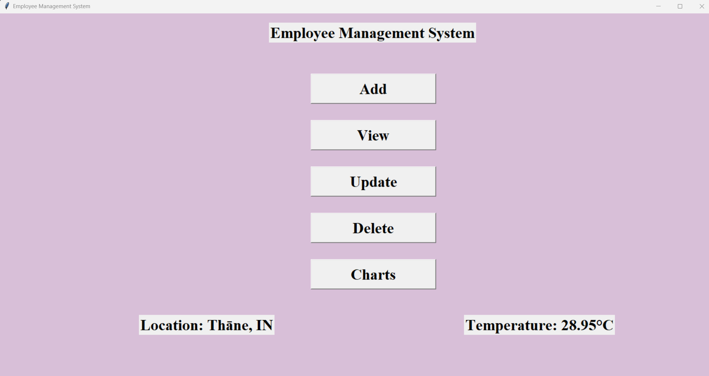

# Employee Management System 🏢  

A simple **Python** desktop application for managing employee records, built using **Tkinter** for the GUI and **SQLite** for the database. This system allows users to add, update, view, and delete employee details, as well as visualize the top 5 highest earners using **Matplotlib**.  

---

## 📌 Features  

✅ **Add Employee** – Store new employee details (ID, Name, Salary).  
✅ **View Employees** – Display all employees with their details.  
✅ **Update Employee** – Modify employee records (name, salary, or both).  
✅ **Delete Employee** – Remove an employee from the database.  
✅ **Salary Charts** – Visualize the top 5 highest-earning employees.  
✅ **Location & Temperature** – Fetch current location and temperature using an API.  

---

## 🖼️ GUI Preview  

  

---

## 🛠️ Technologies Used  

- **Python** (Tkinter for GUI, SQLite for database, Matplotlib for charts)  
- **Requests** (to fetch location and weather data)  
- **APIs Used**:  
  - [ipinfo.io](https://ipinfo.io) – Get user's location  
  - [OpenWeatherMap](https://openweathermap.org/) – Fetch current temperature  

---

## ⚡ Installation & Setup  

1️⃣ Clone the repository:  
```bash
git clone https://github.com/ShravaniRG03/Employee-Management-System.git
cd Employee-Management-System
```

2️⃣ Install dependencies:  
```bash
pip install requests matplotlib sqlite3 tkinter
```

3️⃣ Run the application:  
```bash
python EMS.py
```

---

## 🎯 Usage  

### 1️⃣ **Adding an Employee**  
- Click **"Add"** and enter Employee ID, Name, and Salary.  
- Click **"Save"** to store details.  

### 2️⃣ **Viewing Employees**  
- Click **"View"** to see all employee records.  

### 3️⃣ **Updating Employee Details**  
- Click **"Update"** and select whether to update Name, Salary, or Both.  
- Enter the Employee ID and update the required fields.  

### 4️⃣ **Deleting an Employee**  
- Click **"Delete"**, enter the Employee ID, and remove the record.  

### 5️⃣ **Viewing Salary Charts**  
- Click **"Charts"** to visualize the top 5 highest earners.  

---

## 📌 Database Schema  

| ID | Name | Salary |
|----|------|--------|
| 1  | John Doe | 50000 |
| 2  | Jane Smith | 60000 |

---


## 📜 License  

This project is **open-source** and available under the [MIT License](LICENSE).  

---

⭐ **If you found this project helpful, give it a star!** ⭐  
